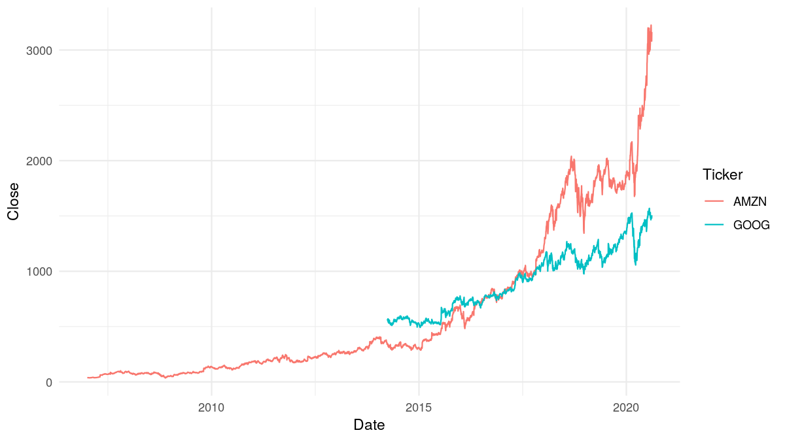
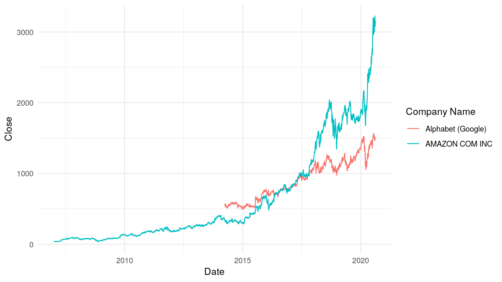

README
================

<!-- README.md is generated from README.Rmd. Please edit that file -->

# simfinapi 

[](https://www.tidyverse.org/lifecycle/#experimental)
[](https://cran.r-project.org/package=simfinapi)
[](https://github.com/Plebejer/simfinapi/actions)
[](https://codecov.io/gh/Plebejer/simfinapi)
[](https://cran.r-project.org/package=simfinapi)

## What does simfinapi do?

simfinapi wraps the <https://simfin.com/> Web-API to make SimFin data
easily available in R.

*To use the package, you need to register at <https://simfin.com/login>
and obtain a SimFin API key.*

## Example

In this example, we download some stock price data and turn these into a
simple plot.

``` r
# load package
library(simfinapi)

# download stock price data
tickers <- c("AMZN", "GOOG") # Amazon, Google
prices <- sfa_get_prices(tickers)
```

Please note that all functions in simfinapi start with the prefix
`sfa_`. This makes it easy to find all available functionality.

The downloaded data looks like this:

| SimFinId | Ticker | Date       | Currency |  Open |  High |   Low | Close | Adj. Close |   Volume | Dividend | Common Shares Outstanding |
| -------: | :----- | :--------- | :------- | ----: | ----: | ----: | ----: | ---------: | -------: | -------: | ------------------------: |
|    62747 | AMZN   | 2007-01-03 | USD      | 38.68 | 39.06 | 38.05 | 38.70 |      38.70 | 12405100 |       NA |                        NA |
|    62747 | AMZN   | 2007-01-04 | USD      | 38.59 | 39.14 | 38.26 | 38.90 |      38.90 |  6318400 |       NA |                        NA |
|    62747 | AMZN   | 2007-01-05 | USD      | 38.72 | 38.79 | 37.60 | 38.37 |      38.37 |  6619700 |       NA |                        NA |
|    62747 | AMZN   | 2007-01-08 | USD      | 38.22 | 38.31 | 37.17 | 37.50 |      37.50 |  6783000 |       NA |                        NA |
|    62747 | AMZN   | 2007-01-09 | USD      | 37.60 | 38.06 | 37.34 | 37.78 |      37.78 |  5703000 |       NA |                        NA |
|    62747 | AMZN   | 2007-01-10 | USD      | 37.49 | 37.70 | 37.07 | 37.15 |      37.15 |  6527500 |       NA |                        NA |

Let’s turn that into a simple plot.

``` r
# load ggplot2
library(ggplot2)

# create plot
ggplot(prices) +
  aes(x = Date, y = Close, color = Ticker) +
  geom_line()
```



Suppose we would like to display the actual company name instead of the
ticker. To do so, we download additional company information and merge
it to the `prices` data:

``` r
company_info <- sfa_get_info(tickers)
```

`company_info` contains these information:

| SimFinId | Ticker | Company Name      | IndustryId | Month FY End | Number Employees |
| -------: | :----- | :---------------- | ---------: | -----------: | ---------------: |
|    62747 | AMZN   | AMAZON COM INC    |     103002 |           12 |           798000 |
|       18 | GOOG   | Alphabet (Google) |     101002 |           12 |            98771 |

Now we merge both datasets and recreate the plot with the actual company
names.

``` r
# merge data
merged <- merge(prices, company_info, by = "Ticker")

# recreate plot
ggplot(merged) +
  aes(x = Date, y = Close, color = `Company Name`) +
  geom_line()
```



## Installation

simfinapi is not yet available on [CRAN](https://cran.r-project.org/),
but you can install it from
[GitHub](https://github.com/Plebejer/simfinapi):

``` r
remotes::install_github("https://github.com/Plebejer/simfinapi")
```

## Code of Conduct

Please note that the ‘simfinapi’ project is released with a [Contributor
Code of Conduct](.github/CODE_OF_CONDUCT.md). By contributing to this
project, you agree to abide by its terms.
