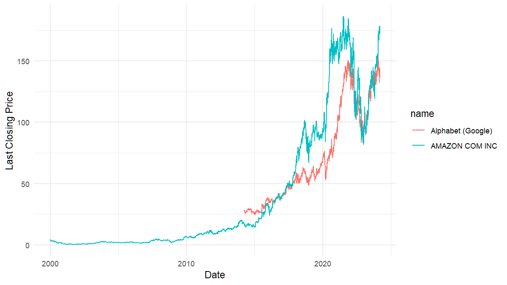

# simfinapi 

[](https://lifecycle.r-lib.org/articles/stages.html#experimental)
[](https://CRAN.R-project.org/package=simfinapi)
[](https://www.repostatus.org/#active)
[](https://github.com/matthiasgomolka/simfinapi/actions)
[](https://codecov.io/gh/matthiasgomolka/simfinapi)
[](https://cran.r-project.org/package=simfinapi)

## What does simfinapi do?

simfinapi wraps the <https://simfin.com/> Web-API to make ‘SimFin’ data
easily available in R.

*To use the package, you need to register at <https://simfin.com/login>
and obtain a ‘SimFin’ API key.*

## Example

In this example, we download some stock price data and turn these into a
simple plot.

``` r
# load package
library(simfinapi)

# download stock price data
tickers <- c("AMZN", "GOOG") # Amazon, Google
prices <- sfa_get_prices(tickers)
```

Please note that all functions in simfinapi start with the prefix
`sfa_`. This makes it easy to find all available functionality.

The downloaded data looks like this:

| simfin\_id | ticker | date       | currency |  open |  high |   low | close | adj\_close |   volume | dividend | common\_shares\_outstanding |
|-----------:|:-------|:-----------|:---------|------:|------:|------:|------:|-----------:|---------:|---------:|----------------------------:|
|      62747 | AMZN   | 2007-01-03 | USD      | 38.68 | 39.06 | 38.05 | 38.70 |      38.70 | 12405100 |       NA |                          NA |
|      62747 | AMZN   | 2007-01-04 | USD      | 38.59 | 39.14 | 38.26 | 38.90 |      38.90 |  6318400 |       NA |                          NA |
|      62747 | AMZN   | 2007-01-05 | USD      | 38.72 | 38.79 | 37.60 | 38.37 |      38.37 |  6619700 |       NA |                          NA |
|      62747 | AMZN   | 2007-01-08 | USD      | 38.22 | 38.31 | 37.17 | 37.50 |      37.50 |  6783000 |       NA |                          NA |
|      62747 | AMZN   | 2007-01-09 | USD      | 37.60 | 38.06 | 37.34 | 37.78 |      37.78 |  5703000 |       NA |                          NA |
|      62747 | AMZN   | 2007-01-10 | USD      | 37.49 | 37.70 | 37.07 | 37.15 |      37.15 |  6527500 |       NA |                          NA |

Let’s turn that into a simple plot.

``` r
# load ggplot2
library(ggplot2)

# create plot
ggplot(prices) +
  aes(x = date, y = close, color = ticker) +
  geom_line()
```



Suppose we would like to display the actual company name instead of the
ticker. To do so, we download additional company information and merge
it to the `prices` data:

``` r
company_info <- sfa_get_info(tickers)
```

`company_info` contains these information:

| simfin\_id | ticker | company\_name     | industry\_id | month\_fy\_end | number\_employees | business\_summary                                                                                                                                                                                                                                               |
|-----------:|:-------|:------------------|-------------:|---------------:|------------------:|:----------------------------------------------------------------------------------------------------------------------------------------------------------------------------------------------------------------------------------------------------------------|
|      62747 | AMZN   | AMAZON COM INC    |       103002 |             12 |           1298000 | Amazon.com Inc is an online retailer. The Company sells its products through the website which provides services, such as advertising services and co-branded credit card agreements. It also offers electronic devices like Kindle e-readers and Fire tablets. |
|         18 | GOOG   | Alphabet (Google) |       101002 |             12 |            135301 | Alphabet (formerly known as Google) offers a variety of IT services to individuals and corporations alike. Their main revenues come from online advertising.                                                                                                    |

Now we merge both datasets and recreate the plot with the actual company
names.

``` r
# merge data
merged <- merge(prices, company_info, by = "ticker")

# recreate plot
ggplot(merged) +
  aes(x = date, y = close, color = company_name) +
  geom_line()
```


## Installation

From [CRAN](https://CRAN.R-project.org/package=simfinapi):

``` r
install.packages("simfinapi")
```

If you want to try out the newest features you may want to give the
development version a try and install it from
[GitHub](https://github.com/matthiasgomolka/simfinapi):

``` r
remotes::install_github("https://github.com/matthiasgomolka/simfinapi")
```

## Setup

Using simfinapi is much more convenient if you set your API key and
cache directory[1] globally before you start downloading data. See
`?sfa_set_api_key` and `?sfa_set_cache_dir` for details.

## Code of Conduct

Please note that the ‘simfinapi’ project is released with a [Contributor
Code of
Conduct](https://github.com/matthiasgomolka/simfinapi/blob/master/.github/CODE_OF_CONDUCT.md).
By contributing to this project, you agree to abide by its terms.

## Relation to `simfinR`

In case you also found `simfinR`
([CRAN](https://CRAN.R-project.org/package=simfinR),
[GitHub](https://github.com/msperlin/simfinR/)) you might want to know
about the differences between the `simfinapi` and `simfinR`. I tried to
compile a list in [this
issue](https://github.com/matthiasgomolka/simfinapi/issues/22#issuecomment-847270864).

------------------------------------------------------------------------

[1] simfinapi always caches the results from your API calls to obtain
results quicker and to reduce the number of API calls. If you set the
cache directory to a permanent directory (the default is `tempdir()`),
simfinapi will be able to reuse this cache in subsequent R sessions.
